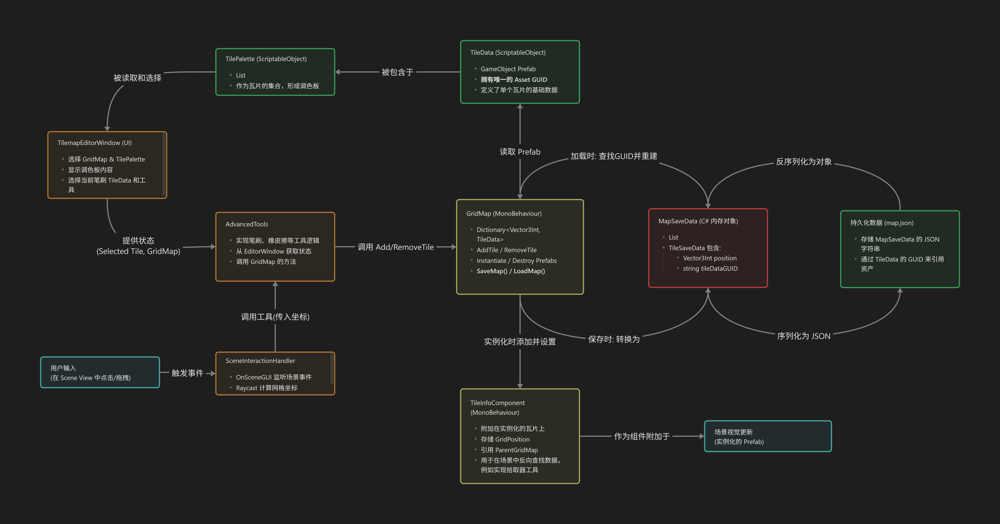

# Unity 3D 瓦片地图编辑器


一个功能强大的Unity编辑器工具，用于快速创建和编辑3D瓦片地图。

## 📋 目录
- [功能特性](#功能特性)
- [快速开始](#快速开始)
- [使用指南](#使用指南)
- [配置](#配置)
- [工作流程建议](#工作流程建议)
- [故障排除](#故障排除)
- [安装方式](#安装方式)
- [贡献指南](#贡献指南)
- [许可证](#许可证)

## 📊 架构图

下图是功能设计的数据导向图


## 🖼️ 预览截图


## ✨ 功能特性

### 核心功能
- **完整的撤销/重做支持**: 所有绘制操作（包括高级工具）均可撤销。
- **直观的瓦片绘制**：像绘画一样在3D空间中放置预制体。
- **网格对齐系统**：自动对齐到网格，确保整齐的布局。
- **多层级建造**：支持垂直空间的堆叠和指定层级的空中建造。
- **实时预览**：鼠标悬停时显示瓦片预览，不同模式显示不同颜色（绿色/蓝色/红色）。
- **旋转支持**：支持4向旋转放置瓦片。
- **数据持久化**：地图数据自动保存到场景中的GridMap组件。
- **地图导出/导入**：支持将地图数据导出为JSON文件，便于分享、备份和版本管理。

### 混合智能模式 (Hybrid Smart Mode)
- **智能堆叠模式 (Smart Stacking)**：鼠标指向现有瓦片的上下表面时，自动在上方或下方进行堆叠（绿色预览）。
- **显式层级模式 (Explicit Layer)**：鼠标指向空中或瓦片侧面时，在指定的Y轴层级上进行建造（蓝色预览）。

### 绘制工具
- **基础画笔**：点击或拖拽绘制瓦片。
- **擦除工具**：移除指定位置的瓦片。
- **油漆桶**：泛洪填充相同类型的连续区域。
- **矩形填充**：绘制矩形区域。
- **直线工具**：绘制直线。
- **圆形工具**：绘制圆形轮廓。

---

## 快速开始

### 1. 创建瓦片库
1.  在Project窗口中右键选择 `Create > Tilemap Editor > Tile Palette` 创建一个新的瓦片库资源。
2.  选中新创建的瓦片库，在Inspector中将你的瓦片预制体拖拽到 `Tile Prefabs` 列表中。

### 2. 设置场景
1.  打开 `Tools > Tilemap Editor > 3D Tilemap Editor` 打开编辑器窗口。
2.  在窗口中点击 "创建新的网格地图" 按钮，在场景中创建一个 `GridMap` 对象。
3.  在编辑器窗口的 `Palette Selection` 部分，将第一步创建的瓦片库分配给 `瓦片库` 字段。

### 3. 开始绘制
1.  从编辑器窗口的 `瓦片库` 面板中选择一个预制体。
2.  在场景视图 (Scene View) 中点击或拖拽鼠标进行绘制。
3.  使用工具和快捷键来提高效率。

---

## 使用指南

### 编辑器窗口

编辑器窗口由多个可折叠的面板组成：

- **Palette Selection**: 选择和管理 `TilePalette` 瓦片库。
- **瓦片库**: 以网格形式显示当前库中的所有瓦片，点击即可选中。
- **Grid Map**: 管理场景中的 `GridMap` 对象，提供加载、保存和清空功能。
- **编辑工具**: 切换绘制/擦除/拾取模式，选择高级工具，并开启/关闭智能堆叠。
- **层级控制**: 设置当前编辑的Y轴高度，并可开启“层级隔离”模式，仅显示当前层级的瓦片。
- **旋转控制**: 控制放置瓦片的旋转角度。

### 快捷键

- **`Ctrl+Z` / `Cmd+Z`**: **撤销**上一步操作 (支持所有绘制和清空操作)。
- **`B`**: 切换 **绘制模式** 和 **擦除模式**。
- **`I`**: 切换到 **拾取模式**，用于从场景中拾取瓦片。
- **`R`**: 顺时针旋转90度。
- **`ESC`**: 取消当前工具绘制操作。
- **左键单击/拖拽**: 执行绘制或擦除。
- **UI按钮 `▲` / `▼`**: 调整当前编辑层级。
 
 ### 新增功能详解

#### 瓦片拾取器 (Eyedropper Tool)
- **激活方式**: 点击编辑器窗口中的“拾取器”按钮，或按快捷键 `I`。
- **功能**: 进入拾取模式后，在场景中左键点击任何一个已放置的瓦片，编辑器会自动从瓦片库中选中对应的预制体，并同步其旋转状态，然后自动切换回绘制模式，方便快速复制和延续已有样式。

#### 层级隔离 (Layer Isolation)
- **激活方式**: 在“层级控制”面板中，勾选“层级隔离”开关。
- **功能**: 开启后，场景视图将只显示“当前层级”所指定的Y轴高度上的瓦片，隐藏所有其他层级的瓦片。这在编辑复杂的多层建筑内部时非常有用，可以避免视线被遮挡。关闭开关后，所有瓦片恢复显示。

### 多层级编辑 (核心)

本工具的核心是混合智能编辑模式，它无缝结合了两种建造方式。此功能可通过 **智能堆叠 (Smart Stacking)** 开关来启用或禁用。

#### 1. 智能堆叠模式 (Smart Stacking)

- **触发条件**: 当 **智能堆叠** 开启时，鼠标指向一个已存在瓦片的 **上表面** 或 **下表面**。
- **预览颜色**: **绿色**。
- **放置逻辑**:
    - 指向**上表面**时 (法线朝上)，总是在被击中瓦片的 **正上方一层** 放置新瓦片。
    - 指向**下表面**时 (法线朝下)，总是在被击中瓦片的 **正下方一层** 放置新瓦片。
- **Y轴范围**: **受GridMap的网格Y轴范围限制**。瓦片只能在GridMap组件定义的Y轴尺寸内堆叠。

#### 2. 显式层级模式 (Explicit Layer)

- **触发条件**:
    1.  鼠标指向 **空中** (没有击中任何瓦片)。
    2.  鼠标指向已存在瓦片的 **侧面**。
    3.  **智能堆叠** 功能被关闭。
- **预览颜色**: **蓝色**。
- **放置逻辑**: 总是在 **层级控制器 (Layer Control)** 指定的Y轴高度上放置瓦片。
- **Y轴范围**: 受GridMap的网格Y轴范围限制。

---

## 配置

### 瓦片库 (Tile Palette)

`TilePalette` 是一个ScriptableObject资源，用于管理一组瓦片预制体。

- **Tile Prefabs**: 存储所有瓦片预制体的列表。
- **Inspector功能**:
    - **验证 (Validate)**: 移除列表中的空引用。
    - **按名称排序 (Sort by Name)**: 对列表中的预制体按名称排序。
    - **清空所有 (Clear All)**: 移除所有预制体。

### 网格地图 (Grid Map)

`GridMap` 是一个MonoBehaviour组件，挂载在场景对象上，作为地图数据的容器。

- **Grid Size**: 定义地图的尺寸 (X, Y, Z)。
- **Cell Size**: 每个网格单元的世界空间大小。
- **Grid Offset**: 整个网格的世界空间偏移。
- **Show Grid**: 是否在场景中显示网格线。
- **Grid Color**: 网格线的颜色。
- **Current Palette**: 链接到此地图使用的 `TilePalette`。

#### 地图数据管理

- **Load Map**: 根据存储的瓦片数据重新生成场景中的所有瓦片对象。
- **Save Map**: 验证并清理无效的瓦片数据。
- **Clear All Tiles**: 清空地图上的所有瓦片（支持撤销）。
- **Export to JSON**: 将完整的地图数据（包括网格设置、瓦片位置、旋转等）导出为JSON文件。
- **Import from JSON**: 从JSON文件导入地图数据，完全恢复地图状态（支持撤销）。

---

## 工作流程建议

### 地图版本管理
利用JSON导出/导入功能，你可以建立高效的地图版本管理工作流程：

1. **定期备份**: 在重要修改前导出当前地图状态。
2. **版本迭代**: 为不同版本的地图使用描述性文件名（如 `level1_v1.0.json`, `level1_v1.1.json`）。
3. **团队协作**: 团队成员可以通过JSON文件分享地图设计。
4. **快速切换**: 在不同设计方案间快速切换，无需重新绘制。

### 最佳实践
- 在开始大量编辑前，先导出当前状态作为备份。
- 使用有意义的文件名来标识地图的用途和版本。
- 定期清理无效数据（使用Save Map按钮）以保持最佳性能。

---

## 故障排除

**Q: 瓦片预览图不显示?**
A: 确保预制体有Renderer组件，或在编辑器中稍等片刻等待Unity生成预览。

**Q: 智能堆叠不工作?**
A: 确保瓦片预制体包含有效的Collider组件，并检查其Layer设置是否能被射线检测到。

**Q: 智能堆叠模式下，预览是蓝色而不是绿色?**
A: 这通常意味着你指向了瓦片的侧面。智能堆叠仅在指向瓦片的顶部或底部时激活。

**Q: 瓦片放置后消失或加载地图失败?**
A: 检查 `GridMap` 引用的 `TilePalette` 是否正确，并确保 `TileData` 中存储的预制体GUID是有效的。

**Q: 导入JSON后瓦片显示不正确?**
A: 确保导入时使用的 `TilePalette` 包含JSON文件中引用的所有预制体。如果预制体被移动或重命名，可能需要重新分配到调色板中。

**Q: JSON导出/导入按钮不可见?**
A: 这些功能仅在Unity编辑器中可用。确保你在编辑器模式下查看 `GridMap` 组件的Inspector面板。

---

## 安装方式

### 方法1：直接下载
1. 从 [Releases](../../releases) 页面下载最新的 `.unitypackage` 文件
2. 在Unity中导入：`Assets > Import Package > Custom Package`

### 方法2：Git URL（推荐）
1. 打开Unity，进入 `Window > Package Manager`
2. 点击左上角的 `+` 按钮
3. 选择 "Add package from git URL"
4. 输入：`https://github.com/shee-py/Unity-3D-Tilemap-Editor.git`
5. 点击 "Add" 按钮等待安装完成

> 💡 **提示**: 如果你想安装特定版本，可以在URL后添加版本标签，例如：
> `https://github.com/shee-py/Unity-3D-Tilemap-Editor.git#v1.0.0`

### 方法3：本地开发（开发者模式）
如果你想要修改包的源代码或进行本地开发：
```bash
cd YourUnityProject/Assets/Plugins
git clone https://github.com/shee-py/Unity-3D-Tilemap-Editor.git TilemapEditor
```

> ⚠️ **注意**: 此方法会将包安装在`Assets/Plugins/`目录下，适合需要修改源代码的开发者使用。

## 贡献指南

欢迎所有形式的贡献！

### 如何贡献
1. Fork 这个仓库
2. 创建你的功能分支 (`git checkout -b feature/AmazingFeature`)
3. 提交你的更改 (`git commit -m 'Add some AmazingFeature'`)
4. 推送到分支 (`git push origin feature/AmazingFeature`)
5. 开启一个 Pull Request

### 报告问题
如果你发现了bug或有功能建议，请在 [Issues](../../issues) 页面创建一个新的issue。

### 开发环境
- Unity 2021.3 或更高版本
- 支持 Windows、macOS、Linux

## 路线图

- [ ] 支持自定义笔刷形状
- [ ] 添加地形工具（高度图支持）
- [ ] 实现瓦片动画系统
- [ ] 支持多人协作编辑
- [ ] 添加更多导出格式

## 致谢

感谢所有为这个项目做出贡献的开发者！

## 许可证

本项目采用 MIT 许可证 - 查看 [LICENSE](LICENSE) 文件了解详情。

### 第三方资源
- Unity引擎 - [Unity Technologies](https://unity.com/)
- 图标资源来自 [Material Design Icons](https://materialdesignicons.com/)

---

如果这个工具对你有帮助，请给个 ⭐ Star 支持一下！ 
